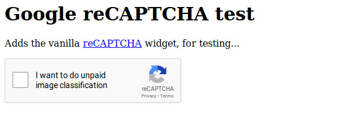

# Make ReCaptcha's "I'm not a robot" accurate

ReCaptcha sucks. It's annoying, arbitrary, and extremely hostile to Tor users. Plus you're doing unpaid image classification labor for Google.

Not much to be done about the first three problems but you can correct the last one - and the "I'm not a robot" text at the same time. The new-and-improved ReCaptcha says "I want to do unpaid image classification".

This was [Evan Prodromou's idea](https://twitter.com/evanpro/status/1098987608020008961) unless you like it, in which case the idea to follow through and make an actual extension was totally all mine.

## Icon

The extension icon was stolen from Google's [Material Design icon set](https://material.io/tools/icons/?search=image_search&icon=image_search&style=baseline) because the MDN WebExtension docs said their sample was from there and then I decided that I enjoyed irony.

If you design an actual icon I'll probably replace the current one with it.

## License

[Creative Commons Zero 1.0 Universal](https://creativecommons.org/publicdomain/zero/1.0/) except for the Google icon, which is under the Apache 2.0 license

## Author

AJ Jordan <alex@strugee.net>
